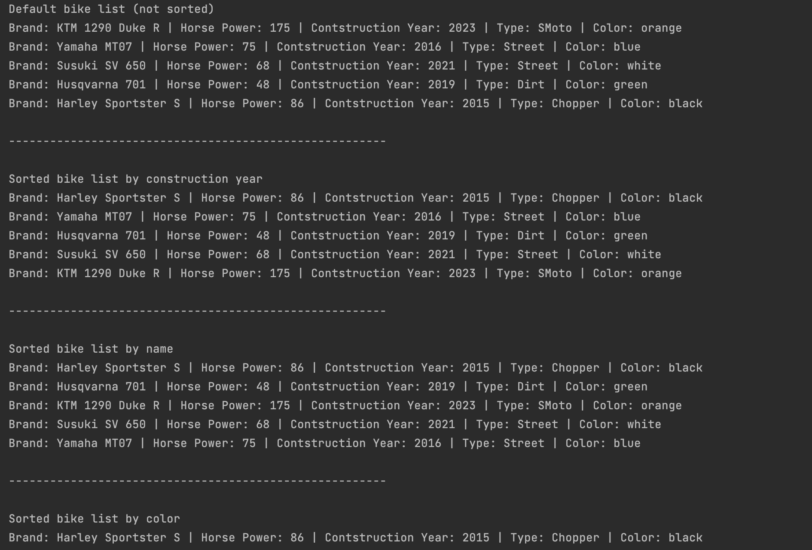

# BIKE PROGRAM #
## Description ##
The program contains a list of different bikes which differ by brand, horse power, construction year, type and color.
The program uses the elements of comparable and comparator to sort the list in different orders according to the specific property.

# Screenshots of output #
